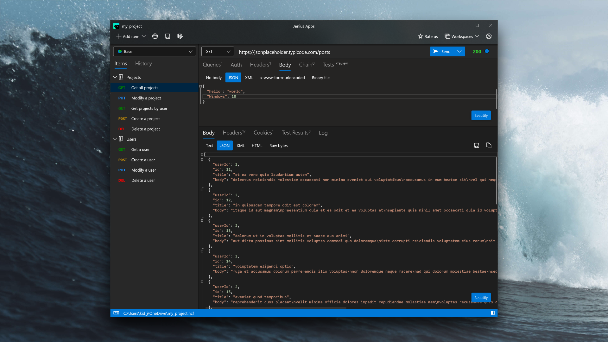

# Nightingale Core

Welcome to the official repository for Nightingale Core -- a .NET Standard 2.0 library containing the core models and functionality required to build the simple and fast [Nightingale REST Client](https://github.com/jenius-apps/nightingale-rest-api-client). The app itself is already available on the Microsoft Store: https://www.microsoft.com/en-us/p/nightingale-rest-api-client/9n2t6f9f5zdn.

## What is Nightingale?

Nightingale is a REST client app that lets you send HTTP requests and view their responses. This is useful when you debug your APIs during development. Or you can send requests to third-party APIs as you build your API-consuming apps. You can do these while using a fast and easy-to-use user interface designed and optimized for Windows 10. And best of all, it only uses about 50 MB of RAM.

## What is the "core"?

Nightingale Core is the .NET Standard 2.0 library which contains the core domain models and logic for Nightingale. The object schema, the request sending logic, the http response parsing, and more are the types of logic available in the core. 

The core already exists, but it's been closed-source, and this repo is where I am moving the core out into the open.

## Why open source it?

I hope to see contributions to the core to help improve Nightingale. Additionally, I would welcome other apps or projects to use this core to build something new, such as a third party REST client or even derivative tools (such as console apps) that take advantage of Nightingale's collection system. 

## Why not open source the entire Nightingale app?

Nightingale's UI uses some licensed controls, and so you need a license in order to compile the app. Thus, open sourcing the app is almost entirely useless since almost no one would be able to clone and compile it.

## Is the core production ready?

Not yet. Nightingale Core is slowly being moved to GitHub piece by piece. Stay tuned for more updates!

## Contact

Follow [@NightingaleUWP](https://twitter.com/NightingaleUWP) for updates on the app.

Reach me at [@kid_jenius](https://twitter.com/kid_jenius) if you have questions.